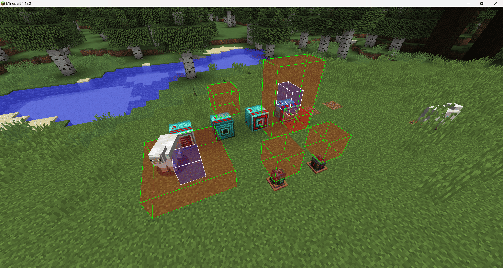
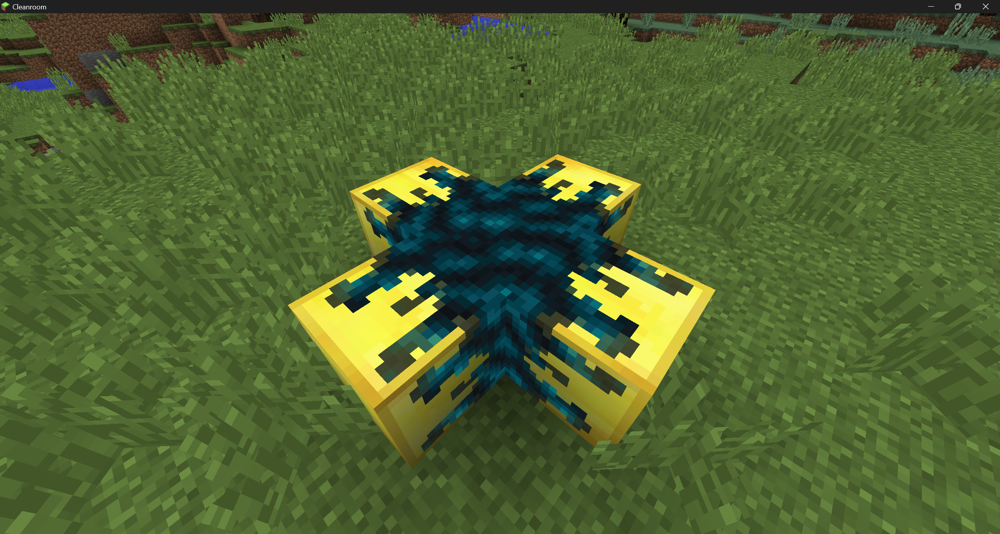

# JustDireThings-Legacy

`JustDireThings-Legacy` is a Minecraft 1.12.2 backport project for [`JustDireThings`](https://github.com/Direwolf20-MC/JustDireThings).
With [Crafttweaker support](https://github.com/zzhalex233/JustDireThings-Legacy/wiki/Crafttweaker-support)

## About

Just Dire Things started as a collection of random items and blocks I wanted added to the game.
Then things kind of got away from me...

### Resources

- 4 tiers of resources
- Progression that requires exploration of different Minecraft dimensions

### Tools

- 4 tiers of tools
- Each tool tier has unique abilities
- Some abilities are never-before-seen

### Armor

- 4 tiers of armor
- Each armor tier has its own unique abilities

### Automation Blocks

Many blocks designed around automation, including:

- Block breakers
- Block placers
- Sensors
- Teleporters
- Energy generators
- Energy distribution blocks

### Gallery

